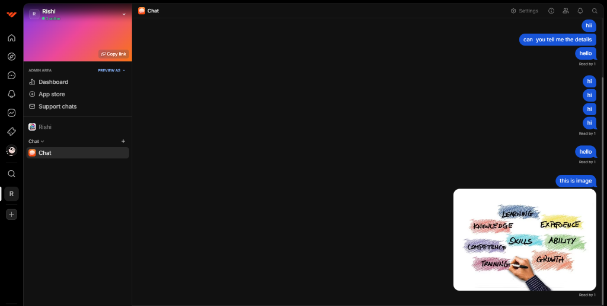

<div align="center">

# 🚀 Whop to Discord Bridge


**A high-performance, resilient bot that bridges Whop Chats with Discord Webhooks in real-time.** 

[View Demo Video](public/Demo.mp4) • [Report Bug](https://github.com/issues) • [Request Feature](https://github.com/issues)

</div>

---
### ✨ Key Features

| Feature | Description |
| :--- | :--- |
| **⚡ Real-Time Polling** | Monitors Whop chats with a customizable 3-second heartbeat. |
| **🛡️ Smart Deduplication** | Uses persistent state (`.message-state.json`) to guarantee 0% message duplication. |
| **🖼️ Rich Media Support** | Automatically detects and renders images in Discord embeds. |
| **🚦 Rate Limit Control** | Intelligent `500ms` throttling queue to respect Discord API limits. |
| **🔐 Secure Config** | Enterprise-grade configuration using `.env` variables. |

## 📸 Proof of Concept

> **Source:** Whop Chat
> The bot captures every user interaction, including text repeats and images.



> **Destination:** Discord Channel
> Messages arrive instantly, reflecting the exact state of the source.


---

## 🛠️ Installation & Setup

### 1. Prerequisites
*   **Node.js** (v16 or higher)
*   **NPM** or **Yarn**

### 2. Clone & Install
```bashhttps://github.com/Jaycee1996/Whop-and-Discord-Realtime-Message-Bot/blob/main/README.md
git clone https://github.com/Jaycee1996/Whop-and-Discord-Realtime-Message-Bot.git
cd Whop-and-Discord-Realtime-Message-Bot
npm install
```

### 3. Configuration
Create a `.env` file in the root directory:

```env
# 🔑 Whop Configuration
WHOP_API_KEY=apik_your_app_key_here
WHOP_CHANNEL_ID=chat_feed_your_feed_id_here

# 🔗 Discord Configuration
DISCORD_WEBHOOK_URL=https://discord.com/api/webhooks/your_webhook_url
```

> **Tip:** You can find the `WHOP_CHANNEL_ID` by inspecting the Network tab in your browser while viewing the chat (look for `chat_feed_...`).

### 4. Run the Bot
```bash
# Development Mode
npm run dev

# Production Mode
npm start
```

---

## 🧩 Architecture

The system consists of three core modules:

*   **`whopMessages.ts`**: Handles authentication and fetches generic messages from the Whop GraphQL API.
*   **`discordWebhook.ts`**: Manages the webhook payload construction and enforces the 500ms delay.
*   **`index.ts`**: Orchestrates the polling loop and manages the lifecycle/graceful shutdowns.

## 🤝 Contributing

Contributions are welcome! Please open an issue or submit a pull request for any improvements.

## 📄 License

This project is licensed under the [MIT License](LICENSE).
